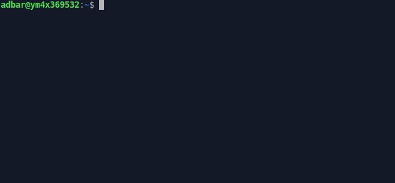

htmldate: find the publication date of web pages
================================================

.. image:: https://img.shields.io/pypi/v/htmldate.svg
    :target: https://pypi.python.org/pypi/htmldate
    :alt: Python package

.. image:: https://img.shields.io/pypi/pyversions/htmldate.svg
    :target: https://pypi.python.org/pypi/htmldate
    :alt: Python versions

.. image:: https://readthedocs.org/projects/htmldate/badge/?version=latest
    :target: https://htmldate.readthedocs.org/en/latest/?badge=latest
    :alt: Documentation Status

.. image:: https://img.shields.io/codecov/c/github/adbar/htmldate.svg
    :target: https://codecov.io/gh/adbar/htmldate
    :alt: Code Coverage

.. image:: https://static.pepy.tech/badge/htmldate/month
    :target: https://pepy.tech/project/htmldate
    :alt: Downloads

|

:Code:           https://github.com/adbar/htmldate
:Documentation:  https://htmldate.readthedocs.io
:Issue tracker:  https://github.com/adbar/htmldate/issues

|

Find original and updated publication dates of any web page. From the command-line or within Python, all the steps needed from web page download to HTML parsing, scraping, and text analysis are included.

In a nutshell
-------------

|

|

With Python:

.. code-block:: python

    >>> from htmldate import find_date
    >>> find_date('http://blog.python.org/2016/12/python-360-is-now-available.html')
    '2016-12-23'
    >>> find_date('https://netzpolitik.org/2016/die-cider-connection-abmahnungen-gegen-nutzer-von-creative-commons-bildern/', original_date=True)
    '2016-06-23'

On the command-line:

.. code-block:: bash

    $ htmldate -u http://blog.python.org/2016/12/python-360-is-now-available.html
    '2016-12-23'

Features
--------

-  Compatible with all recent versions of Python (see above)
-  Multilingual, robust and efficient (used in production on millions of documents)
-  URLs, HTML files, or HTML trees are given as input (includes batch processing)
-  Output as string in any date format (defaults to `ISO 8601 YMD <https://en.wikipedia.org/wiki/ISO_8601>`_)
-  Detection of both original and updated dates

*htmldate* finds original and updated publication dates of web pages using heuristics on HTML code and linguistic patterns. It provides following ways to date a HTML document:

1. **Markup in header**: Common patterns are used to identify relevant elements (e.g. ``link`` and ``meta`` elements) including `Open Graph protocol <http://ogp.me/>`_ attributes and a large number of CMS idiosyncrasies
2. **HTML code**: The whole document is then searched for structural markers: ``abbr`` and ``time`` elements as well as a series of attributes (e.g. ``postmetadata``)
3. **Bare HTML content**: A series of heuristics is run on text and markup:

  - in ``fast`` mode the HTML page is cleaned and precise patterns are targeted
  - in ``extensive`` mode all potential dates are collected and a disambiguation algorithm determines the best one

Performance
-----------

=============================== ========= ========= ========= ========= =======
500 web pages containing identifiable dates (as of 2022-02-18)
-------------------------------------------------------------------------------
Python Package                  Precision Recall    Accuracy  F-Score   Time
=============================== ========= ========= ========= ========= =======
articleDateExtractor 0.20       0.769     0.691     0.572     0.728     3.0x
date_guesser 2.1.4              0.738     0.544     0.456     0.626     11x
goose3 3.1.11                   0.821     0.453     0.412     0.584     10x
htmldate[all] 1.1.0 (fast)      **0.840** 0.911     0.776     0.874     **1x**
htmldate[all] 1.1.0 (extensive) 0.827     **0.990** **0.820** **0.901** 1.6x
newspaper3k 0.2.8               0.729     0.630     0.510     0.675     8.4x
news-please 1.5.21              0.769     0.691     0.572     0.728     19x
=============================== ========= ========= ========= ========= =======

For complete results and explanations see the `evaluation page <https://htmldate.readthedocs.io/en/latest/evaluation.html>`_.

Installation
------------

This Python package is tested on Linux, macOS and Windows systems, it is compatible with Python 3.6 upwards. It is available on the package repository `PyPI <https://pypi.org/>`_ and can notably be installed with ``pip`` (``pip3`` where applicable): ``pip install htmldate`` and optionally ``pip install htmldate[speed]``.

Documentation
-------------

For more details on installation, Python & CLI usage, **please refer to the documentation**: `htmldate.readthedocs.io <https://htmldate.readthedocs.io/>`_

License
-------

*htmldate* is distributed under the `GNU General Public License v3.0 <https://github.com/adbar/htmldate/blob/master/LICENSE>`_. If you wish to redistribute this library but feel bounded by the license conditions please try interacting `at arms length <https://www.gnu.org/licenses/gpl-faq.html#GPLInProprietarySystem>`_, `multi-licensing <https://en.wikipedia.org/wiki/Multi-licensing>`_ with `compatible licenses <https://en.wikipedia.org/wiki/GNU_General_Public_License#Compatibility_and_multi-licensing>`_, or `contacting me <https://github.com/adbar/htmldate#author>`_.

See also `GPL and free software licensing: What's in it for business? <https://www.techrepublic.com/blog/cio-insights/gpl-and-free-software-licensing-whats-in-it-for-business/>`_

Author
------

This effort is part of methods to derive information from web documents in order to build `text databases for research <https://www.dwds.de/d/k-web>`_ (chiefly linguistic analysis and natural language processing). Extracting and pre-processing web texts to the exacting standards of scientific research presents a substantial challenge for those who conduct such research. There are web pages for which neither the URL nor the server response provide a reliable way to find out when a document was published or modified. For more information:

.. image:: https://joss.theoj.org/papers/10.21105/joss.02439/status.svg
   :target: https://doi.org/10.21105/joss.02439
   :alt: JOSS article

.. image:: https://zenodo.org/badge/DOI/10.5281/zenodo.3459599.svg
   :target: https://doi.org/10.5281/zenodo.3459599
   :alt: Zenodo archive

.. code-block:: shell

    @article{barbaresi-2020-htmldate,
      title = {{htmldate: A Python package to extract publication dates from web pages}},
      author = "Barbaresi, Adrien",
      journal = "Journal of Open Source Software",
      volume = 5,
      number = 51,
      pages = 2439,
      url = {https://doi.org/10.21105/joss.02439},
      publisher = {The Open Journal},
      year = 2020,
    }

-  Barbaresi, A. "`htmldate: A Python package to extract publication dates from web pages <https://doi.org/10.21105/joss.02439>`_", Journal of Open Source Software, 5(51), 2439, 2020. DOI: 10.21105/joss.02439
-  Barbaresi, A. "`Generic Web Content Extraction with Open-Source Software <https://hal.archives-ouvertes.fr/hal-02447264/document>`_", Proceedings of KONVENS 2019, Kaleidoscope Abstracts, 2019.
-  Barbaresi, A. "`Efficient construction of metadata-enhanced web corpora <https://hal.archives-ouvertes.fr/hal-01371704v2/document>`_", Proceedings of the `10th Web as Corpus Workshop (WAC-X) <https://www.sigwac.org.uk/wiki/WAC-X>`_, 2016.

You can contact me via my `contact page <https://adrien.barbaresi.eu/>`_ or `GitHub <https://github.com/adbar>`_.

Contributing
------------

`Contributions <https://github.com/adbar/htmldate/blob/master/CONTRIBUTING.md>`_ are welcome!

Feel free to file issues on the `dedicated page <https://github.com/adbar/htmldate/issues>`_. Thanks to the `contributors <https://github.com/adbar/htmldate/graphs/contributors>`_ who submitted features and bugfixes!

Kudos to the following software libraries:

-  `lxml <http://lxml.de/>`_, `dateparser <https://github.com/scrapinghub/dateparser>`_
-  A few patterns are derived from the `python-goose <https://github.com/grangier/python-goose>`_, `metascraper <https://github.com/ianstormtaylor/metascraper>`_, `newspaper <https://github.com/codelucas/newspaper>`_ and `articleDateExtractor <https://github.com/Webhose/article-date-extractor>`_ libraries. This module extends their coverage and robustness significantly.
